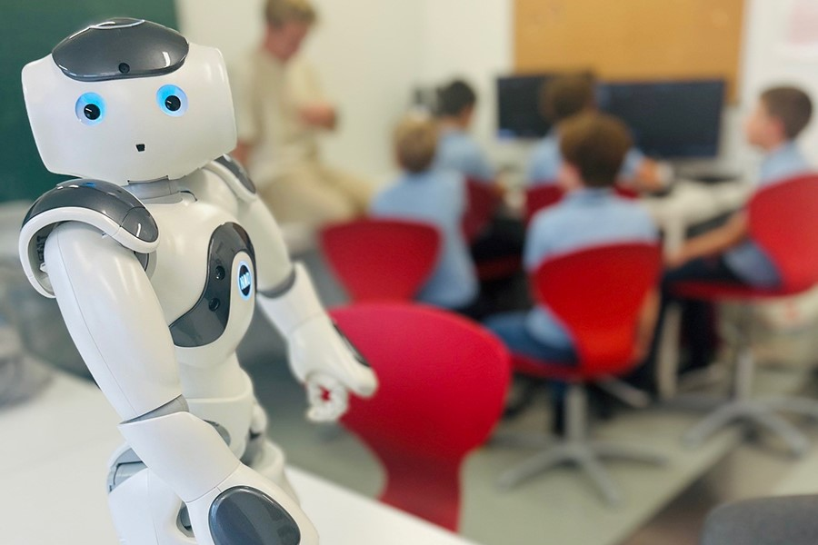
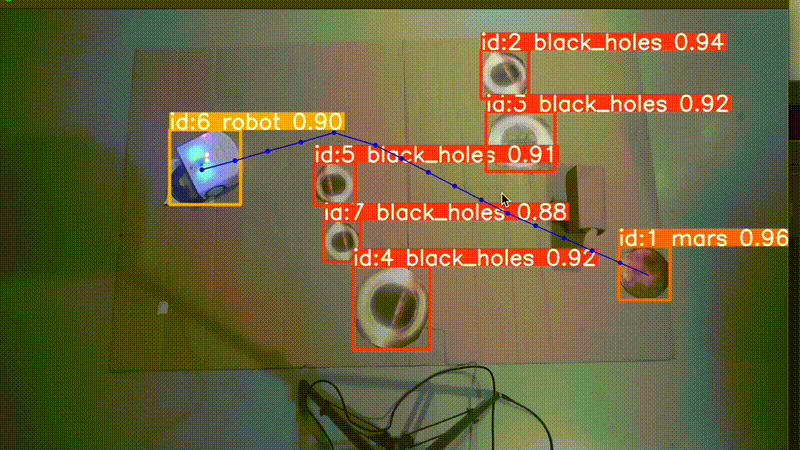
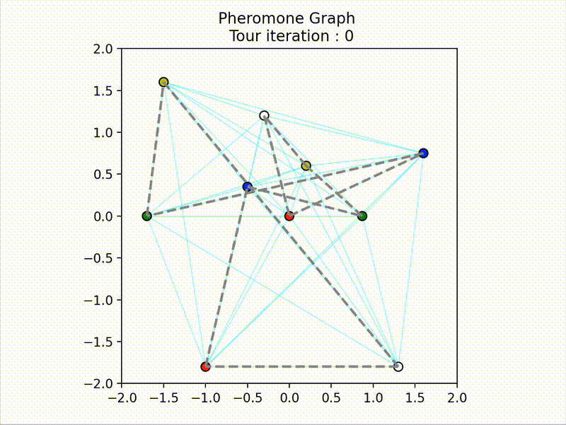
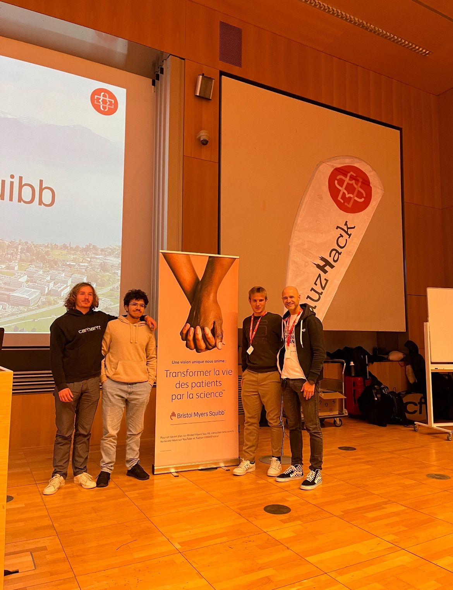

<h1 align="left">Hi, I'm Gabriel 👋</h1>

**Fresh Engineer in Robotics** : I created this page to help you easily navigate through my different projects and explore them in more detail.  
If you’d like a broader overview of my journey and experiences, you can find my **[📄 Resume here](./Gabriel_PAFFI_Resume.pdf)**.

Explore my main projects below by clicking on any image to open the repository. 

---

## 🎨 Project Gallery

  
  
  

  
  
  
  <a href="https://github.com/Gabriel29062001/MILP" title="Optimization / MILP">
    
  

