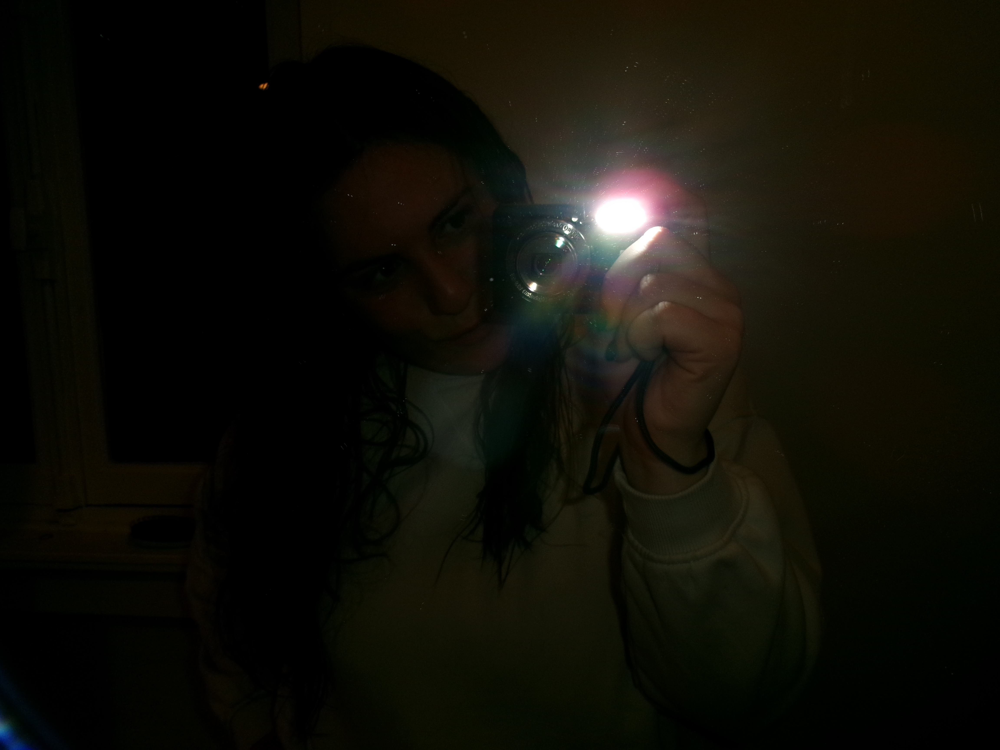

<h1 align="left">Hi, I'm Gabriel 👋</h1>

**Engineer in Robotics at EPFL** : I created this page to help you easily navigate through my different projects and explore them in more detail.  
If you’d like a broader overview of my journey and experiences, you can find my **[📄 Resume here](./Gabriel_PAFFI_Resume.pdf)**.
Explore my main projects below. click any image to open the repository. 

---

  
  

  
  

  

---
